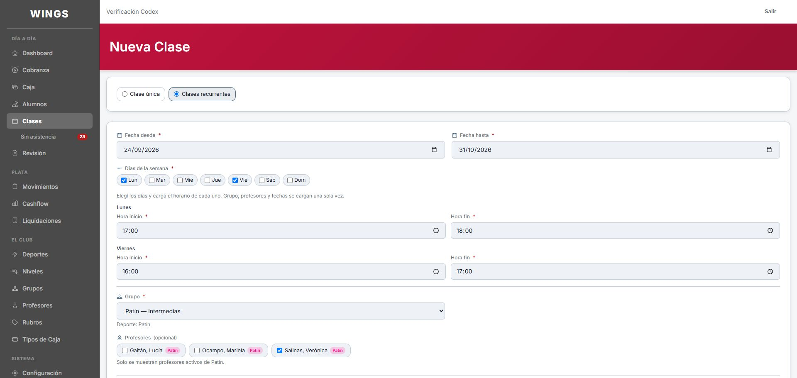
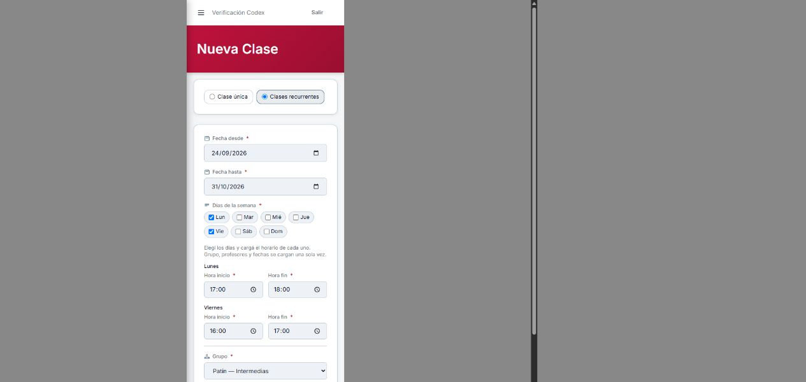
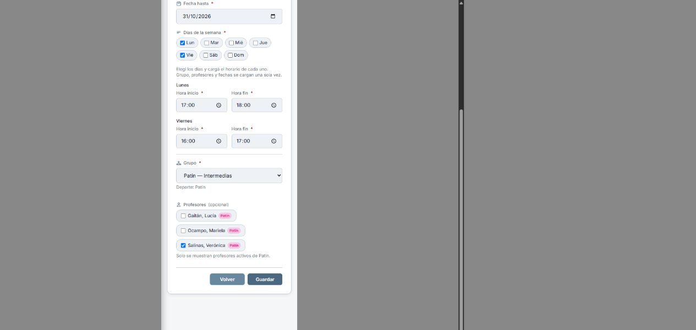
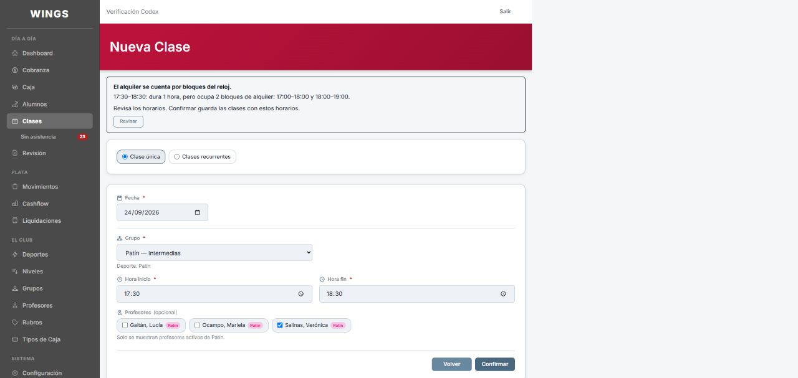
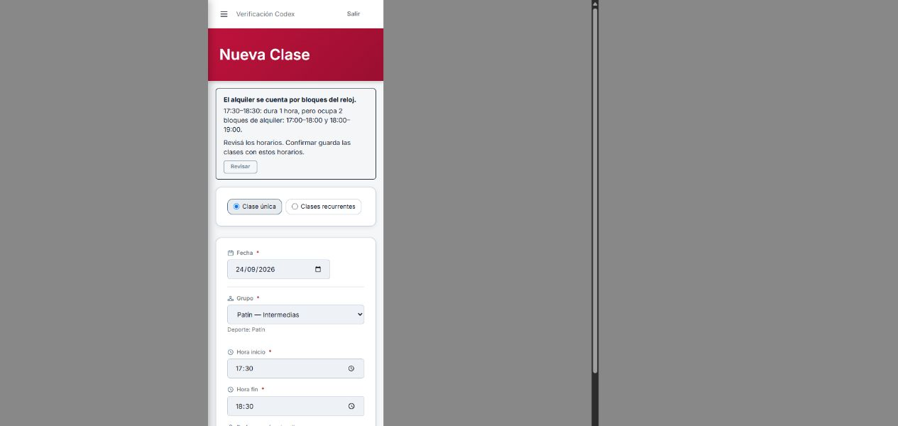
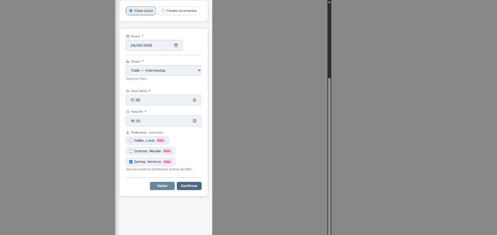

# A15/A16 — Propuesta para Carlos, 06/10/2026

**Autorizada por Carlos el 06/10: «Si, bien!!».** Capturas de la propuesta
conservadas abajo. Implementación local entregada, pendiente de control ajeno; no desplegada.

A15: Carlos decidió «Avisar y permitir seguir con confirmación».
Ejemplo: 17:30–18:30 dura una hora y ocupa dos bloques del reloj:
17:00–18:00 y 18:00–19:00. Guardar debe devolver el aviso sin crear clases;
Confirmar permite guardar el horario revisado. Cambiarlo exige renovar el aviso.
No se calculan precios ni se implementa el alquiler POS-07.

A16: antes del cambio, el formulario y `ClaseWebController::store` admitían un solo
horario para todos los días seleccionados. Eso obligaba a repetir grupo,
profesor y período cuando los días tienen horas distintas.

Propuesta: conservar un formulario por grupo y permitir inicio/fin por cada
día seleccionado. Ejemplo: Intermedias, lunes 17–18 y viernes 16–17,
del 24/09 al 31/10, profesor y grupo elegidos una sola vez.

| Grupo | Días y horarios | Clases | Cargas anteriores | Propuesta |
|---|---|---:|---:|---:|
| Patín Principiantes | L/Mi 16–17 | 10 | 1 | 1 |
| Patín Intermedias | L 17–18; V 16–17 | 11 | 2 | 1 |
| Patín Avanzadas | M/J 17–18 | 11 | 1 | 1 |
| Patín Federadas | M/J 18–19; S 10–11 | 17 | 2 | 1 |
| Fútbol Principiantes | L 16–17; Mi 18–19 | 10 | 2 | 1 |
| Fútbol Avanzadas | M/J 19–20; S 11–12 | 17 | 2 | 1 |
| Total | 24/09–31/10 inclusive | 76 | 10 | 6 |

Fuente del ejemplo: [cronograma documentado](CRONOGRAMA-SEMANAL.md).
Reproducción independiente previa, sobre backend `ad7f9fb`:
[ensayo histórico](evidencia/a15-a16/A15A16RelevamientoTest.php),
**2 pruebas aprobadas, 33 aserciones**, `wings_testing_codex`.
[Filas concretas de los seis grupos](evidencia/a15-a16/relevamiento-76-clases.json).
Es una reproducción con datos de ensayo; no certifica la base actual del club.
La prueba de integración posterior `ProgramarClasesA15A16Test` comprueba
los seis POST reales, las 76 clases, sus horarios y seis identificadores
de serie. También prueba aviso sin escritura, confirmación y rollback.

## Capturas para autorizar

Wings ejecutado por Laravel con datos de ensayo. La propuesta usa una copia
Blade bajo esta evidencia y los componentes reales; no un HTML simulado.
Estas capturas se tomaron antes de implementar el backend. El aviso
mostrado aquí es el ejemplo visual que Carlos autorizó. La
[entrega posterior](IMPLEMENTACION-A15-A16.md) conserva las capturas finales y su resultado.

Captura móvil: respuesta real dentro del marco de 375, con desplazamiento
vertical para mostrar también los botones. [Login de control](evidencia/verificacion-a56/login-375.jpg)
completo, sin corte horizontal. [Servidor reproducible](evidencia/verificacion-a56/servidor-verificacion.php).

A16, escritorio:

A16, 375, parte superior e inferior:

A15, escritorio:

A15, 375, aviso y botón de confirmación:

Alcance visual propuesto: solo creación de clases y su aviso. Sin CSS
compartido, sin pantalla de asistencia ni vistas de Gemini. Sin a55-inscripcion.
A15/A16 requieren verificación por otro agente después de la entrega.
